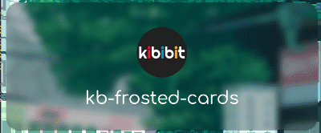
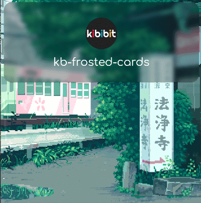
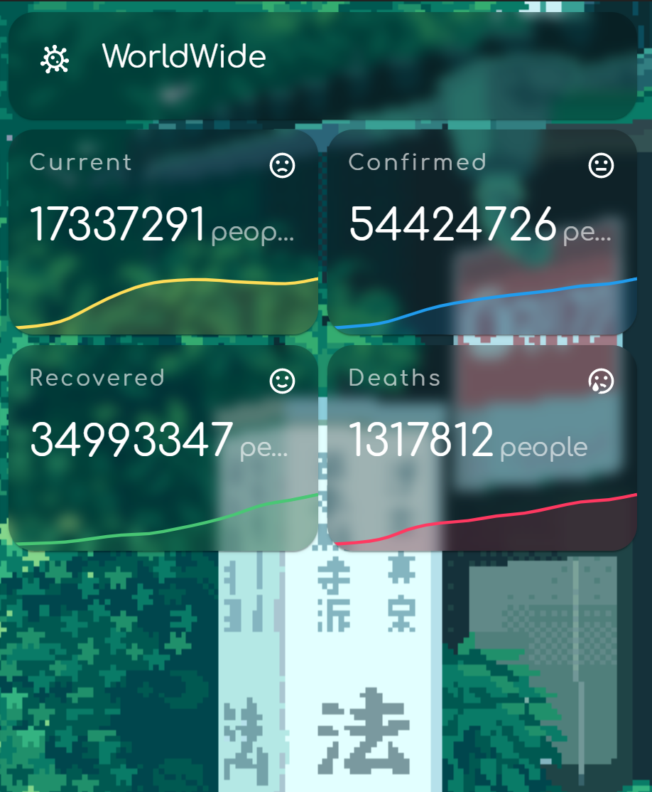

  
  <h2 align="center">
    @kibibit/kb-frosted-cards
  </h2>

  

  

  Make HA Cards and Popups blur everything behind them.

## Installation
### HACS

1. Go to the Community Store.
2. Search for `kibibit`.
3. Navigate to `kibibit` theme.
4. Press `Install`.
5. Reload the frontend

## How it looks?

## Stay in touch

- Author - [Neil Kalman](https://github.com/thatkookooguy)
- Website - [https://github.com/kibibit](https://github.com/kibibit)
- StackOverflow - [thatkookooguy](https://stackoverflow.com/users/1788884/thatkookooguy)
- Twitter - [@thatkookooguy](https://twitter.com/thatkookooguy)
- Twitter - [@kibibit_opensrc](https://twitter.com/kibibit_opensrc)
